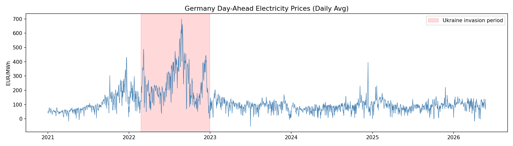
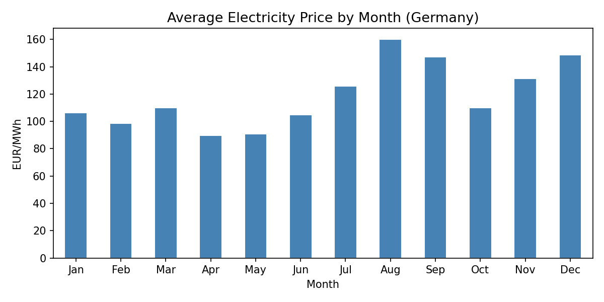
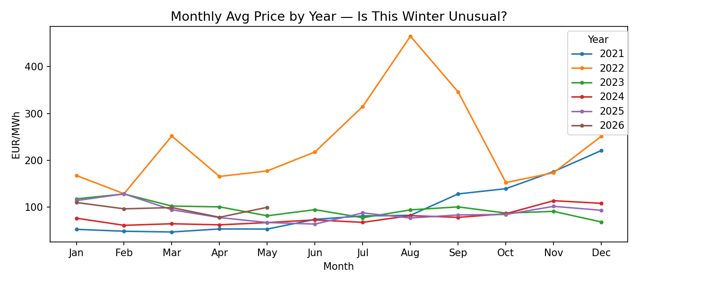
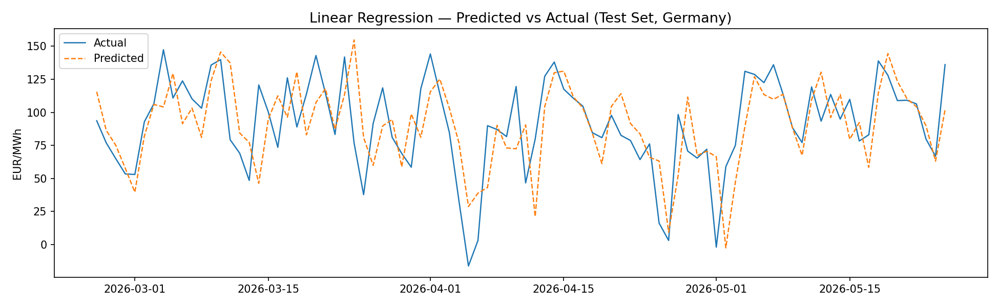
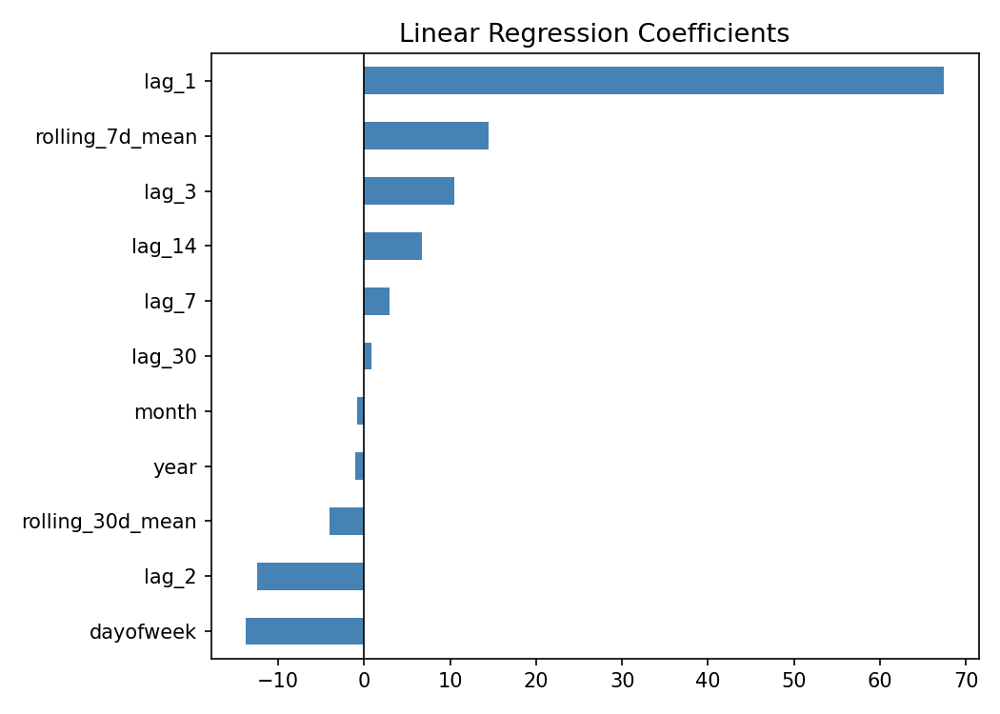

# Phase II — Team Update

Open with a short paragraph: one sentence on what the EU Energy Security Index is,
then a few sentences summarizing what this phase delivered — you pulled real data and
cleaned it, explored it with summary statistics and charts, built your first
machine-learning model on real data, drafted the app's data model and database schema,
and made initial UI wireframes.
 
## At a glance

 
## Updates since Phase I
Say clearly whether your plan changed, and address each of these even if the answer is
"no change" (the graders specifically ask):
 
- Did any **persona** change, or did you add or edit any **user stories**?
- Did you find or confirm any **new datasets** for the ML? Mention that you secured
  **ENTSO-E** access, that **Eurostat** and **Open-Meteo** are your keyless real-data
  sources for now, and that **AGSI** (gas storage) access is still pending.
- Any change in **scope or modeling approach** worth noting.
## Real data curation
 
### ML 1
**Where it came from and how:** 
- Pulled hourly day-ahead electricity prices for the Germany-Luxembourg bidding zone (DE_LU) from the ENTSO-E Transparency Platform via the entsoe-py Python library
- Date range: January 1, 2021 through May 25, 2026 — 64,267 hourly records pulled directly into a pandas Series

**Cleaning (pandas/numpy):** 
- Renamed columns to timestamp and price_eur_mwh for clarity
- Parsed timezone-aware timestamps using dd:mm:yyyy format and converted to Europe/Berlin timezone
- Sorted chronologically and checked for missing values (found zero gaps, no filling required)
- Extracted time features from timestamps: hour, day of week, month, year, and whether or not it's a weekend
- Aggregated hourly records into daily averages, reducing the dataset to 1,971 rows (one per day)

**Saved to CSV** 
- Saved both the full hourly cleaned file (prices_hourly_DE.csv) and the daily averaged file (prices_daily_DE.csv) to avoid re-running the API

**Exploratory analysis:** 
- **Single-variable:** daily average prices ranged from -53.87 to 699.44 EUR/MWh, with a mean of 126.51 and standard deviation of 99.48 (high variance driven by the 2022 energy crisis). The median of 95.88 EUR/MWh is more representative of typical conditions outside the crisis period. Negative prices occur briefly when renewable generation exceeds demand.
- **Two-variable:** correlation between price and calendar month was 0.204 (meaning seasonality alone does not explain price movements). Recent price history proved far more predictive, which is confirmed by the model's coefficient analysis showing lag_1 as the dominant feature.
### ML 2
- **Where it came from and how:** which sources you pulled, that you pulled via API into
  Python (e.g. as JSON).
- **Cleaning (pandas/numpy):** the steps you ran — matching country codes (Eurostat uses
  "EL" for Greece → "GR"), handling missing values, lining up time periods, turning daily
  weather into yearly features.
- **Saved to CSV** so you don't have to re-run the API every time.
- **Exploratory analysis:** report your **single-variable** summary stats (averages,
  spread) and your **two-variable** stats (how things relate — e.g. electricity price
  rises with gas price and import dependence, falls with renewables share).
## Data visualizations
### ML 1

**EDA Chart 1: Germany Day Ahead Electricty Prices**

Shows how prices evolved continuously over time. Prices held steady around 50–100 EUR/MWh through 2021, spiked to 699 EUR/MWh during the 2022 Ukraine invasion period, then normalized to 75–150 EUR/MWh through 2026, confirming that the current environment is not historically unusual.

**EDA Chart 2: Average Electricty Price by Month**

Compares monthly averages as discrete categories. Summer months (July–September) average 125–160 EUR/MWh while spring (April–May) is cheapest at ~90 EUR/MWh. Note: these figures are inflated by the 2022 crisis peak.

**EDA Chart 3: Monthly Average Price pper Year**

Overlays each year's monthly trajectory for direct comparison. 2022 is a clear outlier peaking at 460 EUR/MWh, while all other years cluster tightly in the 60–130 EUR/MWh range. This answers Marco's question that the current moment is not historically unusual.

**EDA Chart 4: Linear Regression Prediction vs Actual**

Directly evaluates model performance on unseen data. The model tracks the general trend and weekly cycles  across the February–May 2026 test period, with the main weakness being sudden sharp drops. Our R² = 0.265, so the model explains ~27% of the variance. Adjusting this model is somethng we must focus on in Phase 3, along with adding the possibility of selecting other countries for this model, and not Germany alone.

**EDA Chart 5: Linear Regression Coefficients**

Shows which features drive the forecast. `lag_1` dominates by a wide margin, confirming recent price momentum is the strongest signal, while dayofweek and `lag_2` carry negative coefficients reflecting the weekend dip and short-term mean patterns.

### ML 2
Show each chart, and for every one write two things: **why** you chose that chart type,
and **what it tells you about one of your Phase I big questions.** Your charts and the
question each answers:
 
- Import-dependence ranking → which countries rely most on imports.
- Price drivers (scatter) → what pushes household prices up.
- Correlation heatmap → which factors move together.
- Storage vs. historical norm → is this winter unusual? (Lena)
- Price distribution → where one country sits in the EU range. (Marco)
- PCA country map → which countries are most similar.
- Risk ranking → countries ordered from most to least at-risk. (Sofia)
## Machine learning
### ML 1
 
**What we built:** 
- A Linear Regression model predicting daily average electricity prices for Germany, directly targeting Lena's user story of wanting a 30-day price outlook to decide whether to lock in a fixed-rate contract
- Features include lag prices from 1, 2, 3, 7, 14, and 30 days prior, 7-day and 30-day rolling averages, and calendar features (month, day of week, year) — all normalized with StandardScaler before training
- Deliberately more complex than a neighborhood-based (kNN) model as required by the assignment, using learned linear weights across 11 engineered features rather than simple distance-based lookup
- Trained on 2021–May 2026 real ENTSO-E data, with the last 90 days held out as a test set

**The plan for two models:** 
you'll ultimately have at least two models on real data;
  parts not yet on real data (like the day-ahead price forecast) currently use simulated
  data, which is allowed for this phase.

**How well it worked:** 
- On the 90-day test set (roughly February–May 2026), the model tracked the general price trend closely and correctly captured weekly cycles — prices consistently dipping on weekends and recovering on weekdays — confirming it learned real market patterns
- `lag_1` (yesterday's price) was by far the strongest predictor, followed by the 7-day rolling mean and `lag_3`, confirming that recent price momentum dominates
- `rolling_30d_mean` carried a negative coefficient, reflecting mean reversion — when the 30-day average is elevated the model expects a slight pullback
- The model struggled with sudden sharp spikes, which is expected behavior for a linear model — MAE, RMSE, and R² to be inserted once final run completes

**30-day forecast**
- The model accepts any user-specified start date and iteratively predicts 30 days forward, rolling lag features with each step
- Forecasts seeded from real historical prices when the start date is within the dataset, and from iterative predictions when projecting into the future
- Results are saved to CSV and visualized as an interactive Plotly chart — this function will be exposed as a REST API endpoint in Phase III for Lena to interact with on the dashboard

**Difficulties:** 
- ENTSO-E API approval took several days, delaying the start of data collection
- The 2022 crisis creates a significant statistical outlier in the training data, inflating the mean and standard deviation in ways the model has to account for
- No ready-made label for "high price risk" exists in the data — thresholds have to be defined manually for any future classifier work

**What's left:** 
- Insert final MAE, RMSE, and R² scores once the model finishes its latest run
- Connect the forecast function to the React frontend via a REST API endpoint in Phase III
- Add gas storage and electricity demand as additional features once AGSI access is approved
- Train ML2 — the supply-shock vulnerability classifier targeting Sofia's user stories
### ML 2
Describe your modeling work and be honest about its state:
 
- **What you built:** at least one supervised model trained on real cleaned data — your
  high-price classifier — and note it's deliberately **more complex than a neighborhood
  (kNN) model**, which the assignment requires. kNN is used only as a baseline and for the
  "similar countries" feature. Also mention PCA and the risk ranking.
- **The plan for two models:** you'll ultimately have at least two models on real data;
  parts not yet on real data (like the day-ahead price forecast) currently use simulated
  data, which is allowed for this phase.
- **How well it worked:** your results, using the fair "leave-one-country-out" test, and
  what the scores mean.
- **Difficulties:** e.g. API approval wait times, no ready-made "supply-shock" label, etc.
- **What's left:** run everything on real data, pick the final model, add gas-storage
  features once AGSI is approved, build the shock classifier in Phase III.
## Data model — ER diagrams  (CS teammates)
For **each persona**, include a localized data model (an ER diagram) built from the data
their user stories need. Then show one **global ER diagram** that combines them into the
full app. Make sure it includes a place to store the cleaned, pre-processed features used
to train and test the ML models.

 
## Database — first-pass schema (DDL)  (CS teammates)
Include a first draft of the SQL `CREATE TABLE` statements for the global data model,
including the table that holds the ML feature data.
 
## UI wireframes
Show **two screens for each persona** plus **one home/landing page**. Low-fidelity is
fine (hand-drawn is OK). Do **not** include login, password-reset, or account-creation
screens.
 
## Individual posts
Each teammate writes their own post covering: which charts or data-pipeline steps they
personally worked on, which localized data model they were the point person for, and
(optional) a short note about anything notable from the week.






 
